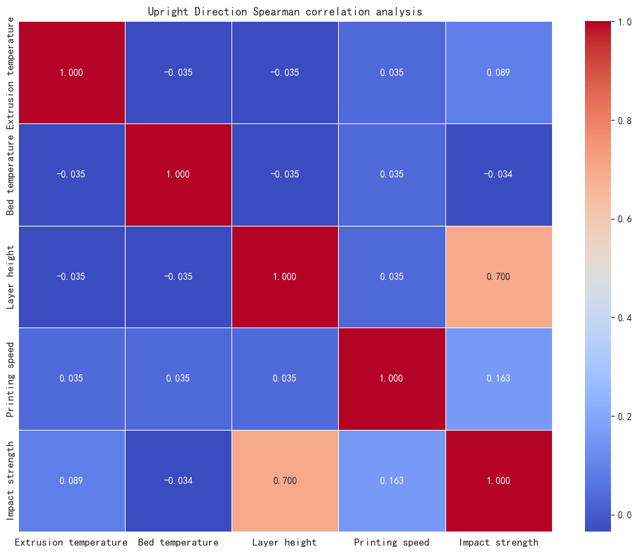

# AI Scientific Research Automatic Drawing（Visualization-illustration-generator）

An open-source desktop tool for interactively generating publication-ready scientific figures from tabular data — seamlessly connecting data → AI prompts → publishable graphics through a visual interface, dramatically reducing the time from dataset to figure.

## *Features*

* Natural language plotting: describe figures conversationally and let AI generate them.
* Real-time visual parameter tuning: legends, axes, annotations, CI bands, error bars, etc.
* Multi-format data input: CSV, Excel, or pasted DataFrame.
* Publication-quality export: PNG (high DPI), SVG (vector), PDF.
* Reproducible code snippets: every generated figure includes executable Python code.
* Style presets: journal-style templates (customizable).
* Batch figure generation: automate plotting across datasets.
* Extensible architecture: easy integration with custom plotting functions or backends (e.g. seaborn, plotly).

### How to run?

1. pip install -r requirements.txt
2. python main.py

## *Tech Stack*

* GUI: PyQt5 (desktop interface and interactive controls)
* AI engine: PandasAI (or compatible LLM backend)
* Data processing: pandas
* Visualization: matplotlib
* Language: Python 3.8+

### *User Workflow / Step-by-Step Guide*
* Launch the application: Run python main.py in the terminal/command prompt.
* Import data: Click the Load Data button, then select a CSV/Excel file, or paste a DataFrame directly.
* Interact with AI: In the prompt box, describe the chart/plot you want using natural language.
* Preview & adjust: The AI returns a draft of the generated chart/plot for preview and further adjustments.
* Export: Export the chart/plot as a PNG file, or copy the AI-generated Python plotting code to your local script for reproduction.

### *Example（Prompt）*

“基于上面传入的excel表格里的样本数据，给我绘制特征及冲击强度的相关性热力图。”

## *Developer and Contributor Guidelines*
* This small open-source project is dedicated to developing a scientific plotting tool for research purposes. We welcome contributions such as bug fixes, suggestions for improvement, and the development of new features to enhance the tool—this is sure to be a rewarding and enjoyable endeavor!
* We encourage you to submit Issues, Pull Requests (PRs), or propose new features (e.g., additional journal templates, support for more plotting libraries, batch processing scenarios, etc.). Please run tests independently before submission to ensure stability.
* When submitting a PR, please include a brief description, screenshots of the changes (if UI-related), and test cases to verify the functionality.

